# shopify-challenge-2022

This is the repository for Shopify's challenge for Backend Dveloper Intern - Fall 2022. The challenge can be found on https://jobs.smartrecruiters.com/ni/Shopify/0b0efc82-7601-40c3-ae99-1c4fb6896b83-backend-developer-intern-fall-2022-remote-us-canada-?utm_source=Intern-site&utm_medium=Intern-site&utm_campaign=May2022

The optional feature I chose is:

* When deleting, allow deletion comments and undeletion

The application can be found on Replit: https://replit.com/@SeanLausanne/shopify-challenge-2022

## Author

* Xiao Ling, xsling28@gmail.com

## Built With

* Node.js
* Express
* MongoDB

## Implementation Details

This is the backend of a inventory management system. It has APIs to perform CRUD operations of inventory items and all deletion comments and undeletion when deleting. The application is built with Node.js and Express. The data are stored in cloud on MongoDB. 

Since this a backend challenge, I focused on the backend code. I didn't build any front UI, which makes it harder for reviewers to test the code. The best way to test backend APIs is to use Postman to send requests. However, reviewers may not be able to use Postman. I coded in the way that reviewers can perform all operations with browser. This caused some unwanted change in code, for example, I'm only using HTTP GET methods. It will be clarified in Test part and in the comments of the code.

## Test

Please go to https://replit.com/@SeanLausanne/shopify-challenge-2022#index.js

Hit Run button or type the following in Shell:

```
npm install
node index.js
```

1. Open the url in a new browser tag: 

   https://shopify-challenge-2022.seanlausanne.repl.co/inventory/cleardb

   The /inventory/cleardb endpoint will clear everything in the database so that we are ready to start a new test.

   

!(/Users/xiaoling/Desktop/untitled folder 2/Screen Shot 2022-05-18 at 17.55.52.png)

2. View all inventory items:

   https://shopify-challenge-2022.seanlausanne.repl.co/inventory/view/all

   The /inventory/view/all endpoint will show all the items in inventory. Now we have nothing in the database so it's an empty table

   

3. Add item:

   In real world, user should send a HTTP POST request with the item being the request body. Because reviewers may not be able to use Postman, I pre-coded 4 item objects in items.json. 

   Reviewers can add the items by go to:

   

   Go to:

   https://shopify-challenge-2022.seanlausanne.repl.co/inventory/add/1

   This will add the first item.

   

   Reviewers can add the other items by going to:

   https://shopify-challenge-2022.seanlausanne.repl.co/inventory/add/2

   https://shopify-challenge-2022.seanlausanne.repl.co/inventory/add/3

   https://shopify-challenge-2022.seanlausanne.repl.co/inventory/add/4

   (only 1, 2, 3, 4 will work, but they can be added multiple times)

   Now reviewers can go to:

   https://shopify-challenge-2022.seanlausanne.repl.co/inventory/view/all

   All 4 items are added to the inventory:

   

4. View a single item:

   Reviewers can view a single instance by going to /inventory/view/itemName, for example:

   https://shopify-challenge-2022.seanlausanne.repl.co/inventory/view/iphone

   

5. Update an item:

   Reviewers can update an item by going to /inventory/itemName?quantity=500. Again in real world, this should be a HTTP PUT request with the request body being the updated item. To allow reviewers to test in browser, I can only put the updated value in the url as query parameter. Only "quantity" is supported now. Given more time, I will improve it in the future.

   Go to:

   https://shopify-challenge-2022.seanlausanne.repl.co/inventory/update/iphone@quantity=300

   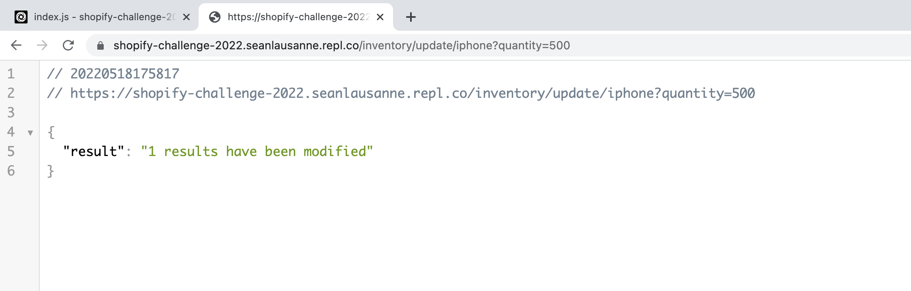

   Then go to:

   https://shopify-challenge-2022.seanlausanne.repl.co/inventory/view/all

   The quantity of iphone has been updated

   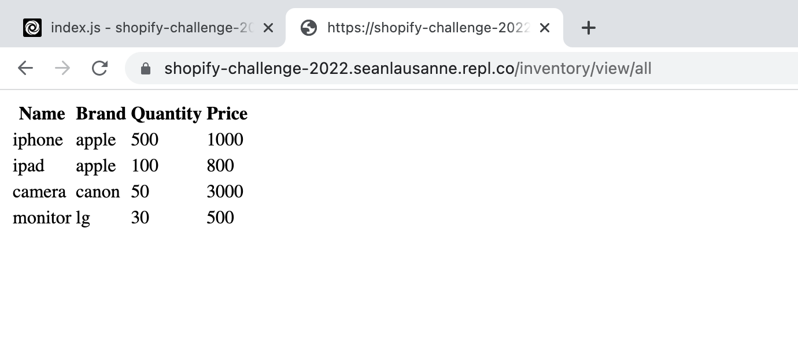

6. Delete an item:

   Reviewers can go to /inventory/delete/itemName to delete an item. Again in real world, this should be a HTTP DELETE request. To allow reviewers to test in browser, I can only put the deletion comments in the url as query parameter. For example:

   https://shopify-challenge-2022.seanlausanne.repl.co/inventory/delete/camera&comments=soldout

   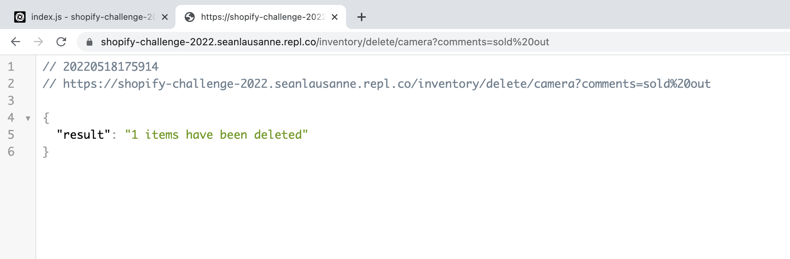

   Another example:

   https://shopify-challenge-2022.seanlausanne.repl.co/inventory/delete/iphone&comments=recall

   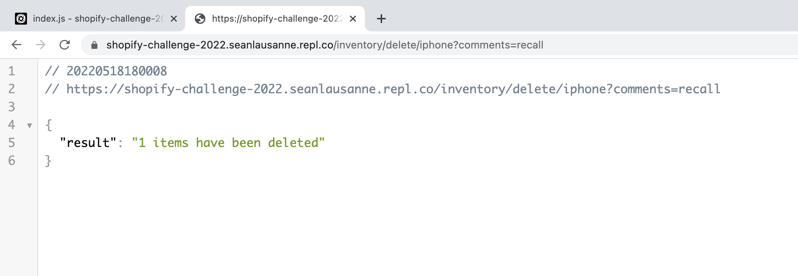

   Reviewers can see the deleted items on:

   https://shopify-challenge-2022.seanlausanne.repl.co/inventory/view/deleted

   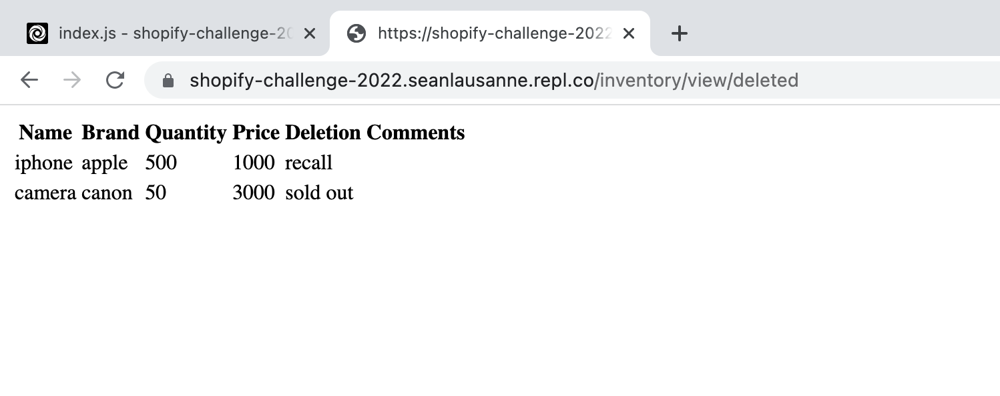

   And these items are deleted from the inventory list:

   https://shopify-challenge-2022.seanlausanne.repl.co/inventory/view/all

   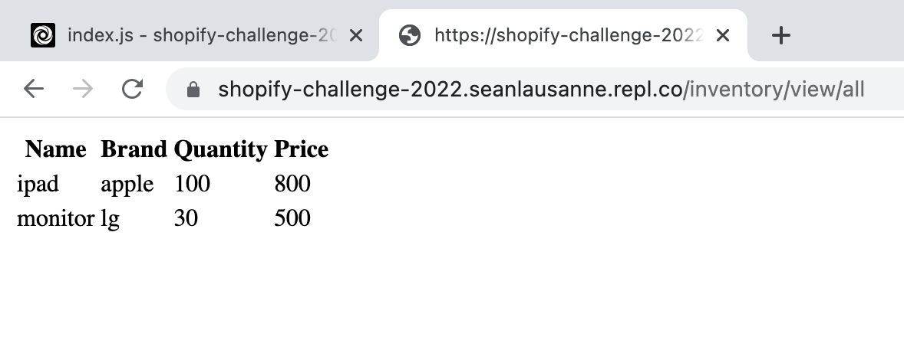

7. Undelete an item:

   Reviewers can undelete an item by going to /inventory/undelete/itemName, for example:

   https://shopify-challenge-2022.seanlausanne.repl.co/inventory/undelete/iphone

   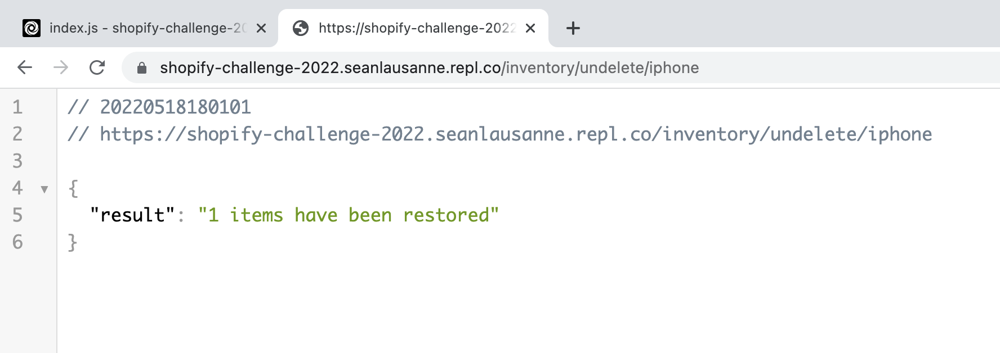

   Now go to 

   https://shopify-challenge-2022.seanlausanne.repl.co/inventory/view/all

   camera has been restored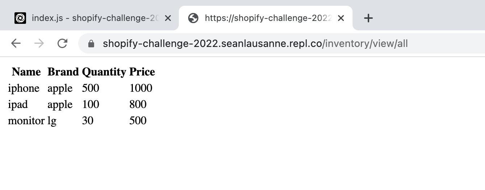

   Go to the deleted list

   https://shopify-challenge-2022.seanlausanne.repl.co/inventory/view/deleted

   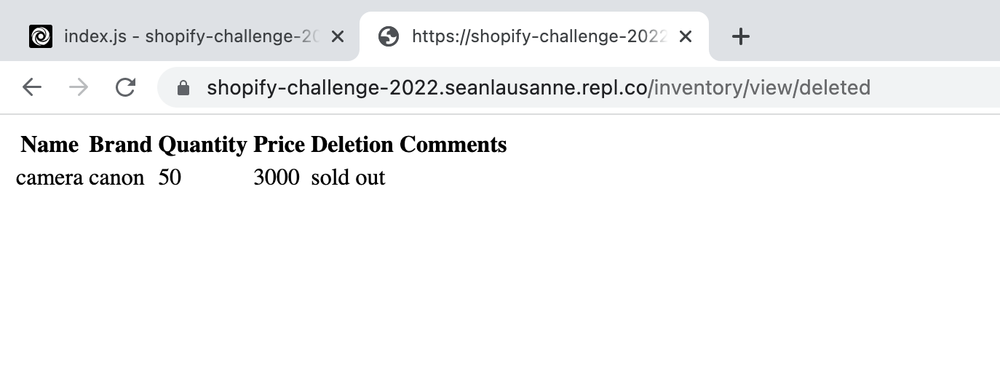

   Camera has been removed from the deleted list

   Reviewers can also permanently delete the items in the deleted list by going to:

   https://shopify-challenge-2022.seanlausanne.repl.co/inventory/purge

   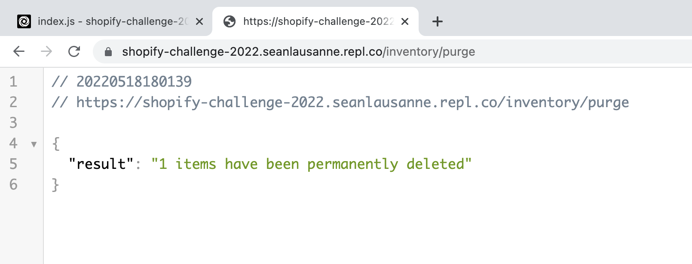

   Now go to：

   https://shopify-challenge-2022.seanlausanne.repl.co/inventory/view/deleted

   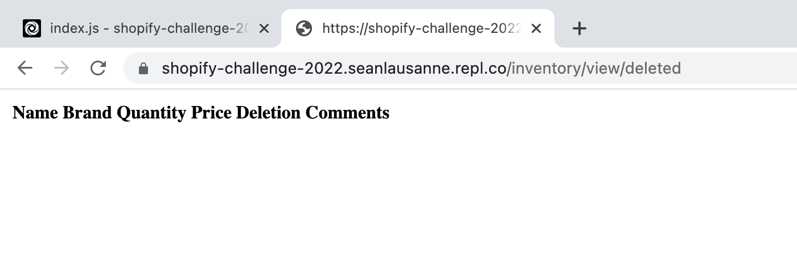

   Everything in the deleted list are permanently removed


## Future Steps

* I will add more parameters to UPDATE operation
* If reviewers can use tools to send different requests, I will change to more proper API
* I will build a simple UI to allow user interaction
